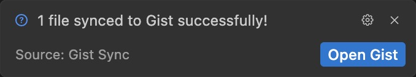

# Gist Sync

[](LICENSE)
[](https://code.visualstudio.com/)

Sync workspace files to a GitHub Gist with a single command.

## ✨ Features

- **Multi-file sync**: Sync any files you configure
- **Per-project Gist**: Each workspace gets its own Gist
- **Manual trigger**: Sync via Command Palette or status bar
- **Zero config auth**: Uses VSCode's built-in GitHub authentication



## 📦 Installation

Install from the [VS Code Marketplace](https://marketplace.visualstudio.com/items?itemName=prberg.gist-sync):

```
ext install prberg.gist-sync
```

Or search for "Gist Sync" in the Extensions view (`Cmd+Shift+X`).

## 🚀 Usage

1. Configure which files to sync in settings (defaults to `TODO.md`)
2. Open Command Palette (`Cmd+Shift+P`) and run **Gist Sync: Sync Files to Gist**
3. Authorize with GitHub when prompted (first sync only)
4. A new private Gist is created and linked to your workspace

The Gist ID is stored in `.vscode/settings.json` for future syncs.

### Commands

| Command                         | Description                            |
| ------------------------------- | -------------------------------------- |
| `Gist Sync: Sync Files to Gist` | Upload configured files to GitHub Gist |

### Status Bar

Click the cloud icon in the status bar to sync. States:

| Icon                    | Meaning            |
| ----------------------- | ------------------ |
| `$(cloud-upload) Gist`  | Ready to sync      |
| `$(sync~spin) Syncing…` | Upload in progress |
| `$(check) Synced`       | Success (3s)       |
| `$(error) Sync Failed`  | Error occurred     |

### Settings

| Setting                        | Description                                               |
| ------------------------------ | --------------------------------------------------------- |
| `gistSync.files`               | Array of files to sync (relative to workspace root)       |
| `gistSync.gistId`              | GitHub Gist ID (auto-populated on first sync)             |
| `gistSync.statusBarExtensions` | File extensions that show the status bar (default: `.md`) |

**Example:**

```json
{
  "gistSync.files": ["TODO.md", "NOTES.md", "docs/ROADMAP.md"],
  "gistSync.statusBarExtensions": [".md", ".txt"]
}
```

## 🛠 Development

```bash
# Install dependencies
bun install

# Build extension
just build

# Watch mode
just watch

# Run tests
just test

# Package as VSIX
just package

# Launch Extension Development Host
# Press F5 in VSCode
```

## 🤝 Contributing

Contributions are welcome! Please feel free to submit a Pull Request.

## 📄 License

This project is licensed under the MIT License - see the [LICENSE](LICENSE) file for details.
